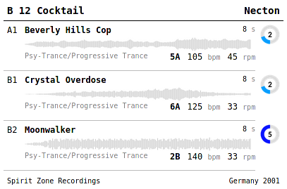

# vinyllabel - create labels from ID3 tags

This program reads meta data from aiff audio files. The audio stream waveform picture will be rendered into a png image. Album, track information and the waveform picture can be freely used in templated html files.



## Installation

Following dependencies need to be fullfilled.

```python
pip install mutagen
pip install jinja2
pip install pydub
pip install Pillow
```

## Usage

```python
vinyllabel.py [-h] [--template T] [--debug D] PATH
```
